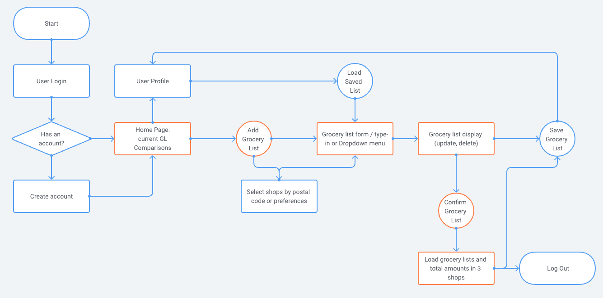
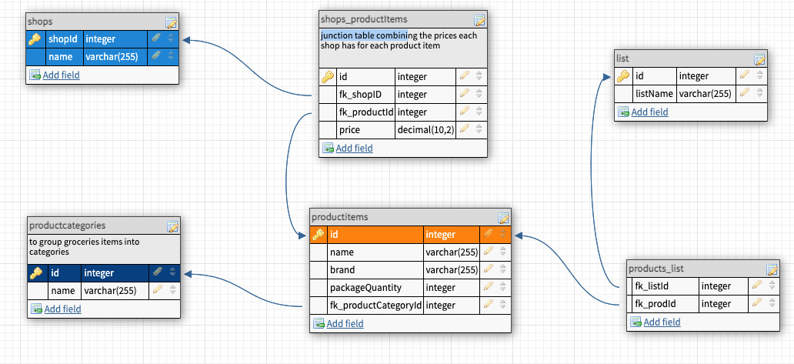

# BestDeal

Best Deal is a price comparison tool for grocery lists. It's my first app and MVP project as part of my Full Stack Development Bootcamp at CodeOp and it was built in a week. 

The main idea is that a user can create a grocery list and receive in exchange how much that grocery list total cost would be in different supermarkets.
The idea behind the app arose a personal need:  why not having a tool that helps you find the most convenient final price of all the combined items you need to shop for, instead of individually searching each item in each shops's site?

The first approach to the project was to find open API's of shops and supermarkets in Barcelona, but since that was finally not available I created the backend and databases with dummy data to prove the concept. 

Here is a first draft of a Userflow. In orange what has been developed and in blue what still hasn't and could be potential ideas for future extensions of the app.

## Dependencies

Run npm install in project directory. This will install server-related dependencies such as Express.
cd into the client golder and run npm install. This will install  all client dependencies (React).

## Database Prep

Access the MySQL interface in your terminal by running mysql -u root -p
Create a new database called groceries: create database groceries
Add a .env file to the project folder of this repository containing the MySQL authentication information for MySQL user. For example:
DB_HOST=localhost
DB_USER=root
DB_NAME=groceries
DB_PASS=YOURPASSWORD

Run npm run migrate in the project folder of this repository, in a new terminal window.

This will create the following tables containing dummy data in your database:

- productcategories
- productitems
- shops
- shops_productItems

So far there are:

3 shops (shops table), each contain 24 product items(productitems table) with different prices each (contained in the shops_productItems table).

### Database Schema: 

Methods and routes built to these tables:

All tables have their get all / get by id methods and routes built. Only the List table contains a Delete and Post method, but has not been used in the front-end yet.

## Development

Run npm start in project directory to start the Express server on port 5001
In another terminal, do cd client and run npm start to start the client in development mode with hot reloading in port 3000.

## Views and Components

### Views

There are currently 3 views:

- Homeview:
  at the begining it only displays the "welcome" component to allow the user to select which shops it would like the app to compare prices in.

  Once the user has added a new grocery list in the AddGroceryList View, the Homeview then displays the list added by the user, a button to save that list (no logic in the button but navigation) and the Supermarket components taht are the ones that display the grocery list prices and total in each chosen Supermarket.

- AddGroceryList View:
  this view displays the "SelectGroceriesForm" component at the top which has the two dropdowns to allow the user to select product categories and products to add to the grocery list.

  at the bottom it displays the "DisplayGroceryList" component that shows the products added to the grocery list.

- Mylists View:
  This view only includes plain html, there is no logic built in to any of the tags or buttons.

### React Components

- Button component is just a button that onClick calls the cb function passed by the parent component. So far it is only used in the AddGroceryList view.
- DisplayGroceryList: displays items added to the grocerylist. User can delete added items.
- Navbar: navigation bar.
- SelectGroceriesForm: contains the 2 dropdown menus with the groceries that can be added to the list.
- Supermarket: displays the confirmed grocery list in each supermarket with the prices of each item and total.
- Welcome: diplays the checkboxes that allow the user to select the shops it wants to compare grocery lists in.

## Styling

Mostly Bootstrap with some CSS to fine-tune certain displays.

## Potential future extensions:
These are some ideas and suggestions for further development that could add more value to the final user of the app:

- Authentication and authorization so that a user can register, login, save, delete, edit and reuse previously used grocery lists.
- Geolocation could potentially help the user decide if the money saved is worth the distance of the shop
- Since APIs aren't available yet, perhaps web scrapping can be a potential solution into populating the tool with real data.
- Receiving alerts for offers of previously purchased product combinations or Receiving recommendations to stock up on product offers

## Technologies used to build this project:

JavaScript ES6+, Node.js, Express.js, React, Bootstrap, CSS, HTML

_This is a student project that was created at [CodeOp](http://codeop.tech), a full stack development bootcamp in Barcelona._

